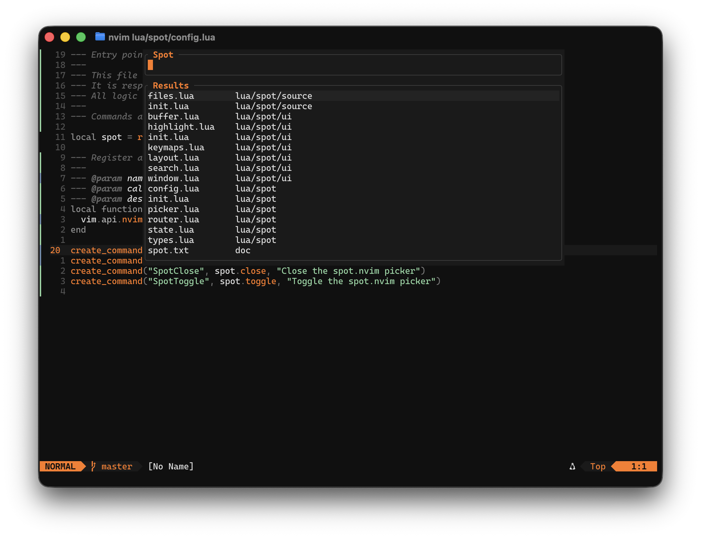

# 🔎 spot.nvim

Prefix-driven command palette for Neovim inspired by the VS Code command palette.

Spot provides a single place to search and execute actions.
Start typing to search files, or add a prefix to switch context instantly —
all within the same input.



## ✨ Features

- 🔎 Prefix-based source switching
- 📂 Fast file search powered by `fd`
- ⚡ Single input workflow
- 🪶 Lightweight floating picker UI
- 🎯 Active mode always visible in the title bar

## 🔥 Status

**spot.nvim** is still under active development and should be considered experimental.

Things may change, and bugs are expected.

If you encounter any issues, please open an issue and include
as much detail as possible — it helps a lot when tracking down problems.

## ⚡ Requirements

- Neovim ≥ 0.10
- [`fd`](https://github.com/sharkdp/fd)

## 📦 Installation

Install using your preferred plugin manager.

### lazy.nvim

```lua
{
  "zitrocode/spot.nvim",
  config = function()
    require("spot").setup()
  end,
}
```

### packer.nvim

```lua
use {
  "zitrocode/spot.nvim",
  config = function()
    require("spot").setup()
  end,
}
```

## 🚀 Usage

### Commands

Spot provides the following user commands:

| Command       | Description                     |
| ------------- | ------------------------------- |
| `:Spot`       | Open the picker                 |
| `:SpotFocus`  | Focus the picker input          |
| `:SpotClose`  | Close the picker                |
| `:SpotToggle` | Toggle the picker open / closed |

### Recommended keymap

```lua
vim.keymap.set(
  "n",
  "<leader><leader>",
  "<cmd>SpotToggle<cr>",
  { desc = "Toggle Spot" }
)
```

### Basic workflow

Typical usage:

```
<leader><leader> → type → confirm
```

Once the picker is open:

- Start typing to search files
- Press `<CR>` to confirm selection
- Press `<ESC>` to normal mode
- Press `q` to close

Picker keymaps:

| Key     | Action            |
| ------- | ----------------- |
| typing  | Filter results    |
| `j`     | Move down         |
| `k`     | Move up           |
| `<CR>`  | Confirm selection |
| `<Esc>` | Normal mode       |
| `q`     | Close picker      |

## 🔀 Prefixes

Spot switches sources using simple prefixes.

Typing a prefix immediately changes the active source.

| Prefix | Source     | Status     |
| ------ | ---------- | ---------- |
| (none) | `files`    | ✅ working |
| `>`    | `keymaps`  | 🚧 planned |
| `:`    | `commands` | 🚧 planned |
| `#`    | `buffers`  | 🚧 planned |
| `$`    | `shell`    | 🚧 planned |

The active source is always visible in the title bar.

## ⚙️ Configuration

**spot.nvim** works out of the box with sensible defaults.

Call `setup()` once:

```lua
require("spot").setup({
  windows = {
    width      = 80,
    max_height = 16,
  },

  sources = { "files" },
  default_source = "files",
})
```

## 🤝 Contributing

Spot is under active development, and contributions are welcome.

If you'd like to get involved, please check the
[CONTRIBUTING.md](./CONTRIBUTING.md) guide for details.

Ideas for new sources, bug reports, and small improvements
are always appreciated.

## 📄 License

MIT
